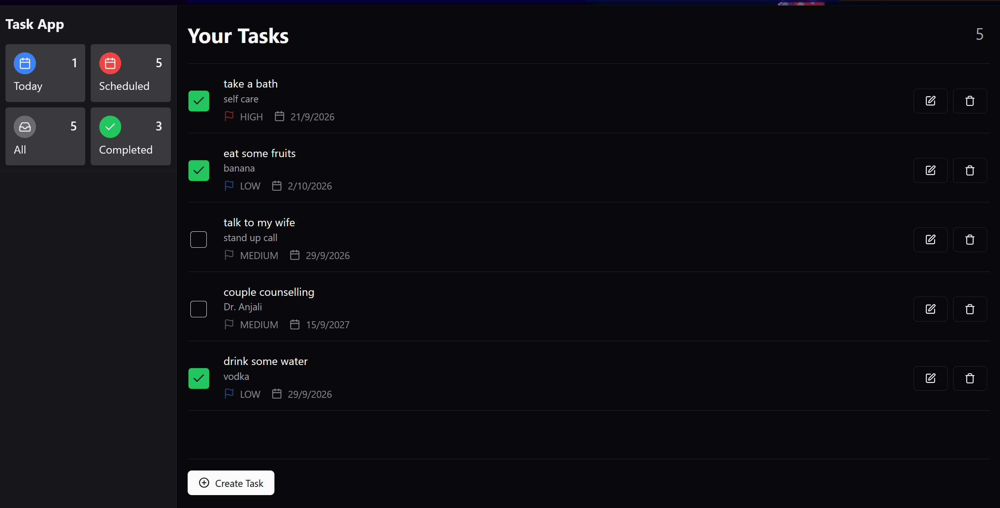
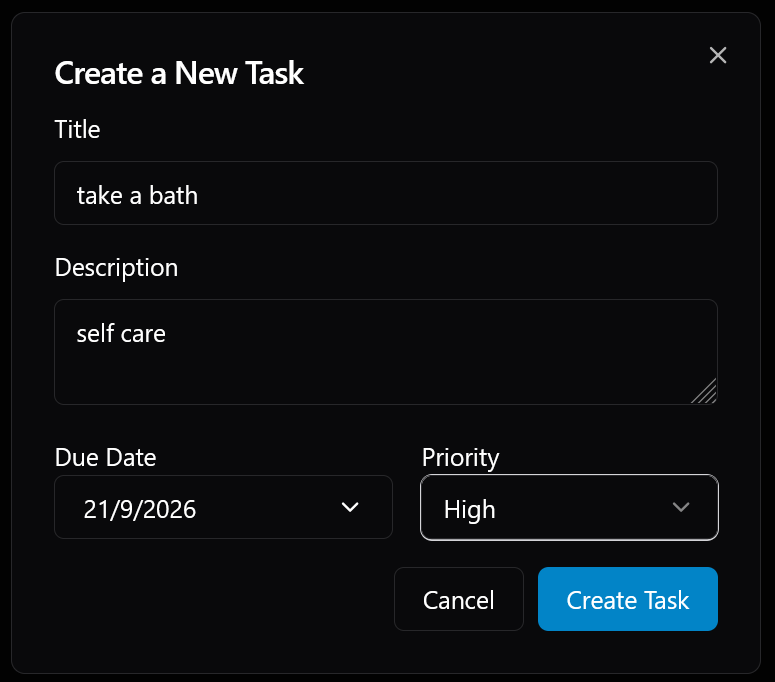
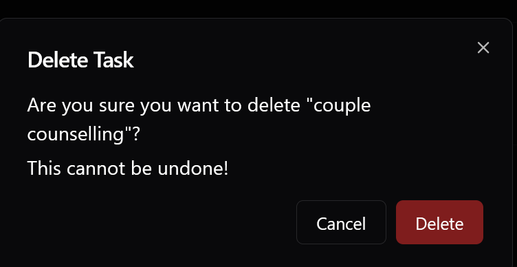

This repo is a step-by-step implementation of a SpringBoot and React-Ts (Vite) built by Devtiro. 
Link - https://youtu.be/M2U4_t_PSRM?si=o1gS5Q-6b8kGcgph  
The frontend is directly pasted from his repo which you can find in the video's description.  
I followed the tutorial as I wanted to learn the SpringBoot framework.
Not gon lie, even tho its a pretty straightforward and basic implementation, its pretty deep bro. Given that I'm a novice, especially with the theory involved in it.
I did feel like I learned something tho, its a helpful build cus it differentiates the MVC layers properly even tho their isnt much backend stuff.  Great tutorial, would recommend it

## Demo

<h3>Main Page</h3>

<h3>Create Task</h3>

<h3>Delete Task</h3>

